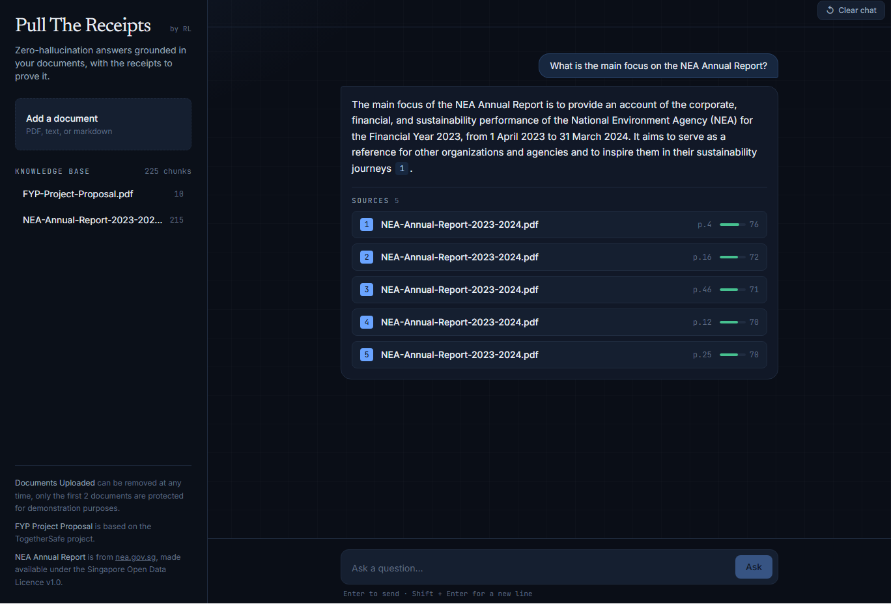
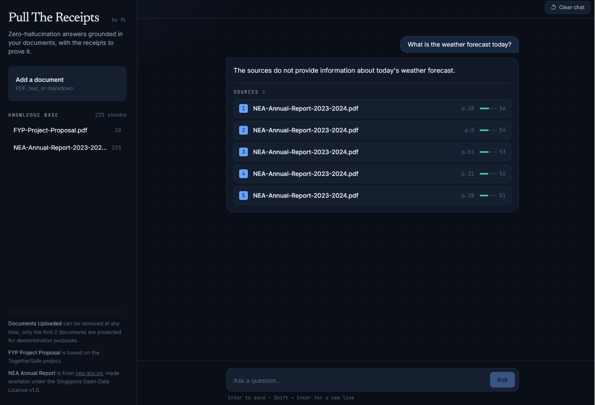
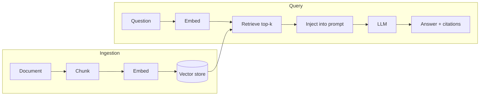

# Pull The Receipts

A document question-answering app that only answers from the files you give it, and shows the exact source behind every claim. If the answer isn't in the documents, it says so instead of guessing.

**Live:** [pullthereceipts-rl.vercel.app/](https://pullthereceipts-rl.vercel.app/) · **Portfolio:** [riskilinardi.vercel.app](https://riskilinardi.vercel.app)

> The backend runs on a free tier that sleeps when idle, so the first question after a while takes ~30–50 seconds to wake up. After that, it's quick.

## Why it works this way

Most "chat with your PDF" tools fall back on the model's general knowledge when the documents don't cover something, which is exactly when an LLM starts making things up. This one is built around a single rule: every claim has to come from a retrieved source, and if the sources don't contain the answer, the app refuses rather than inventing one.

The citations are the whole point. They're what separate a real retrieval system from a model guessing, and they're the part I most wanted to be able to demonstrate and explain.

## How it works

The pipeline is the standard RAG flow, split into two halves.

When a document is uploaded, it's split into overlapping, sentence-aware chunks. Each chunk is turned into an embedding, a vector that places similar text close together and is stored in a vector database along with its source file and page number.

When you ask a question, it's embedded with the *same* model as the chunks (they have to share a vector space to be comparable), the closest chunks are retrieved by cosine similarity, and those chunks are pasted into the prompt ahead of the question. The model answers from that injected context and cites each claim by number, or says the sources don't cover it.

Injecting the retrieved chunks is what keeps it grounded — instead of asking the model to recall what it was trained on, you hand it the specific passages, and it answers from those.

## Choices I made, and why

**No LangChain.** I wrote the pipeline directly. LangChain is the framework most job descriptions name, and I know it, but its abstractions would have hidden the exact steps this project exists to show: chunk, embed, retrieve, augment, and generate. I'd reach for it on a team that needed to move fast; here, writing it by hand was the point.

**Local embeddings (`bge-small-en-v1.5`).** Small enough to run on CPU, free per query, and good enough for retrieval at this scale. It sits behind an interface, so swapping to a hosted embedding model is a one-class change if quality ever needs to go up.

**Chroma for the vector store.** Simple and right-sized for this. It's behind a `VectorStore` interface too — if I needed to scale or share a database with the rest of an app, I'd move to pgvector without touching the pipeline.

**The LLM provider is swappable.** Retrieval quality matters more than model size for RAG, so generation uses a small, cheap model behind an `LLMClient` interface.

Those three interfaces (`Embedder`, `VectorStore`, `LLMClient`) are deliberate — they keep the moving parts replaceable and let the whole pipeline be tested with fakes, no model load or API call needed.

## The documents

Two documents are seeded, so the live demo isn't empty:

- **My final-year project proposal** (TogetherSafe, a mobile app I built solo for disaster preparedness. [repo here](https://github.com/riskilinardi/TogetherSafe)).
- **NEA's Integrated Sustainability Report 2023/2024**, "Transforming Challenges into Sustainable Solutions."

You can upload your own files too; the two seeded ones are protected from deletion, anything you add isn't.

## Tech

Backend: Python, FastAPI, Pydantic, ChromaDB, sentence-transformers, pytest.
Frontend: Next.js, TypeScript, Tailwind.
Deployed on Hugging Face Spaces (backend, Docker) and Vercel (frontend).

## Limitations and what I'd do next

This is a portfolio project, so I made some pragmatic calls worth being upfront about:

- **The vector store is ephemeral on the free tier.** Hugging Face Spaces only keeps `/tmp` writable and wipes it on restart, so the database is re-seeded from the bundled documents each time the app boots. Fine for a demo; in production, I'd attach persistent storage or a managed vector DB.
- **No retrieval threshold.** Retrieval always returns the top-k chunks and lets relevance scores speak for themselves, rather than dropping weak matches below a cutoff. A good threshold is corpus-dependent, and I'd rather tune it against a real evaluation set than hardcode a number.
- **Single-turn only.** Each question is answered independently — there's no conversation memory or follow-up handling yet.
- **Retrieval isn't formally evaluated.** I judged quality by hand. The honest next step is a small evaluation set to measure retrieval precision and compare embedding models on this data rather than on a public leaderboard.

## License

MIT

---

Built by [Riski Linardi](https://riskilinardi.vercel.app) · [GitHub](https://github.com/riskilinardi)
